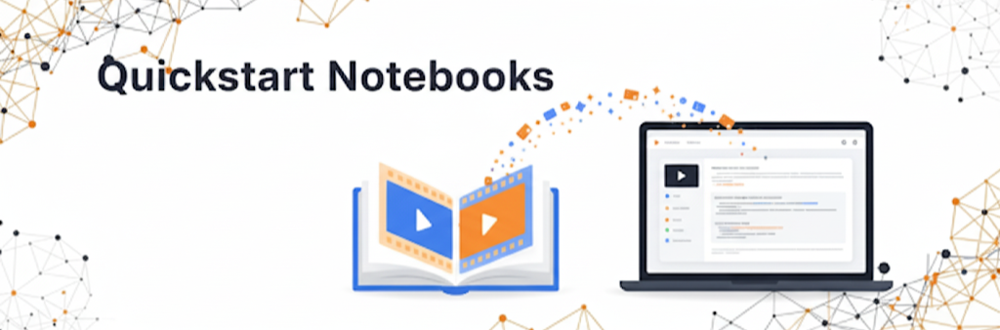

  

# 🎥 VideoDB Workshop: SF Announcement Showcase

Welcome to the **VideoDB San Francisco Workshop** repository, created for AI engineers, startups, and creative professionals. This is your hands-on guide to building real-time, multimodal video applications and interactive media.

Experience firsthand how VideoDB transforms ordinary video streams into extraordinary interactive content by merging human creativity with powerful AI.

We'll be showcasing practical agentic pipelines that demonstrate:

* **Upload → AI Indexing → DeepSearch → Realtime GenAI Editing**
* **Real-time Streams → AI Indexing → Alerts → Updated Streams**

Expect production-grade demos, takeaways you can reuse immediately, and a framework for building the next generation of video intelligence.

---

### 🚀 Get Started Instantly

Experience VideoDB through our interactive notebooks and live demos - no setup required! Simply click any of the demo links below to start exploring. For full functionality, you'll just need a free API key.

**Get Your Free API Key**: [Sign up here](https://console.videodb.io/?ref=github-workshop-sf) and get started with $20 in free credits.

---

  

### 📚 Quickstart Notebooks

These notebooks are your entry point into the world of VideoDB. For a comprehensive collection of advanced demos and more use cases, please visit our official **[VideoDB Cookbook repository](https://github.com/video-db/videodb-cookbook)**.

* **VideoDB Quickstart**: A foundational notebook to get you familiar with uploading, indexing, and searching your first video. This is the best place to begin.

    

* **Retrieval Pipeline (Scene-Level Metadata Indexing)**: Learn how VideoDB automatically indexes video content at a granular, scene-by-scene level, enabling powerful and precise semantic retrieval.

    

---

  

### 🌐 Real-Time Streams (RTStream)

VideoDB's RTStream capability allows you to convert live video feeds into actionable insights. It provides a simple, unified interface for real-time indexing, event detection, and automated alerts.

#### **RTStream Demos**

These notebooks showcase a few of the powerful applications you can build with VideoDB's real-time stream processing. For more use cases, visit our official **[VideoDB Cookbook repository](https://github.com/video-db/videodb-cookbook)**.

* **Real-Time Analysis: Intrusion Detection**: See how to build a live video monitoring system that detects intrusions and triggers alerts in real time, all powered by a simple text prompt.

    

* **Smart Road Safety Monitoring**: Build an AI-powered road monitoring system that detects accidents at toll plazas and traffic congestion on highways, automatically alerting emergency services and traffic authorities for faster response times.

    

#### **Multi-Camera Setup**

VideoDB's multi-camera support unlocks advanced video intelligence by synchronizing and analyzing multiple feeds in real time. This enables richer context, multi-angle event detection, and comprehensive scene understanding—crucial for applications in public safety, sports analytics, and smart environments. With seamless multi-cam integration, you can build solutions that go beyond single-view limitations, delivering actionable insights and next-level automation.

* **Multi-Camera Public Surveillance**: Experience advanced urban monitoring with a 7-camera surveillance network using the WILDTRACK dataset. Learn how to deploy AI-powered analysis across multiple synchronized video feeds to detect incidents in real-time and provide multi-angle evidence for public safety applications.

    

* **Multi-Camera Basketball Analysis**: Transform sports analytics with intelligent multi-camera monitoring of basketball games. This demo showcases how to analyze player movements, detect key game events (baskets, fouls, timeouts), and generate synchronized multi-angle replays for enhanced coaching and analysis.

    

---

  

### 🤖 Live Demos: Chat Agents

The interactive web application demonstrates the power of our agent framework, allowing you to converse with and command video using natural language.

* **VideoDB Director**: An AI-driven video processing and analysis platform that leverages a suite of specialized AI agents and advanced language models to manage a wide range of video-related tasks seamlessly through a chat-based workflow.

    [**Launch Director**](https://chat.videodb.io)

* **DeepSearch (Coming Soon)**: The **DeepSearch Agent**, an intelligent search agent, is designed to deliver highly accurate results by exploring multiple trajectories, rephrasing queries, validating, and reranking results across various indexes. Paired with our improved frontend UI, creating and clipping your videos will be easier than ever. Instantly find similar clips and transform them into ready-to-post vertical videos using our integrated Reel Maker Agent. Stay tuned for smarter, faster, and effortless video workflows.

    *Get beta access: [Beta Access Form](https://forms.gle/iYpjipzEvBdcneFL9)*

---

  

### 🧠 Real-Time Meeting Analysis (Coming Soon)

Experience the future of meetings with our AI bot that can join your conferences and provide real-time insights. Interact with the bot to ask questions, summarize key points, and get answers from the meeting content as it happens.

*Get beta access: [Beta Access Form](https://forms.gle/iYpjipzEvBdcneFL9)*

---

  

### ⏱️ Timeline V2: The Semantic Timeline Agent (Coming Soon)

Introducing **Semantic Timeline**, a new intelligent editing agent within Director designed to make powerful video editing simple and fast. It helps you easily craft videos using various assets—videos, images, audio, text, and captions—each fully customizable with cropping, trimming, volume control, and rich styling.

You can quickly organize your media into structured **Clips** and **Tracks**, add smooth transitions and effects, and build comprehensive timelines effortlessly.

Semantic Timeline offers two powerful ways to work:

* **Programmatic**: Use our developer-friendly SDK to programmatically navigate and edit video content, creating a detailed, searchable timeline of key events.
* **Prompt-Based**: Interactively index and explore your video library and perform complex edits using natural language conversations with The Director. For example, simply describe your edits naturally, such as "Add 'Smoking Kills' in red text whenever a smoking scene appears."

*Get beta access: [Beta Access Form](https://forms.gle/iYpjipzEvBdcneFL9)*

---

  

### 🐒 Video Monkey Agent (Coming Soon)

Introducing **Video Monkey**, your AI-powered editing agent integrated with Google's Nano Banana. Effortlessly edit videos using natural language prompts or visual references—just describe your idea or provide an image, and Video Monkey brings it to life. With Nano Banana, unlock limitless possibilities for creative, precise, and intuitive video editing.

*Get beta access: [Beta Access Form](https://forms.gle/iYpjipzEvBdcneFL9)*

---

  

### ⚙️ Integrations & Workflows

#### **VideoDB: Simplifying AI Video Automations**

Automations for video tasks have always been a challenge. Traditional setups in platforms like **Zapier** and **n8n** require connecting and managing a fragmented ecosystem of services, one for media upload, another for transcription, and separate ones for voice generation, video processing, and content storage. This complexity creates integration headaches and slows down innovation.

VideoDB's new integration changes this. You can build powerful, AI-driven video workflows with just **one connection**, simplifying everything from video indexing and content generation to storage and retrieval. This integrated approach drastically reduces complexity, enabling you to focus on creating and automating rather than wrestling with multiple APIs.

---
#### **Zapier**

VideoDB is now on Zapier, allowing you to seamlessly connect your video content with thousands of other apps.

This integration lets you automate everything from video management to advanced AI analysis, without having to write any code. This simplifies your workflow and helps you focus on what matters most.

**Automated Content Creation Workflow**: This automation demonstrates how VideoDB transforms simple RSS feeds into engaging YouTube Shorts—completely hands-free. It's the perfect solution for anyone looking to maintain a consistent video presence without manual effort. The workflow automatically detects new articles from an RSS feed, uses VideoDB's LLM to generate a script, and then handles the entire video production pipeline—from creating voiceovers and video clips to stitching them together and auto-publishing the finished Short directly to YouTube.

**See It In Action**: The YouTube channel below showcases real videos created using this exact Zapier automation workflow.

[**Explore the Example Channel on YouTube**](https://www.youtube.com/@AthenaeumWorld)

---
#### **N8N**

VideoDB integrates seamlessly with n8n, a powerful open-source workflow automation platform, enabling you to build sophisticated, event-driven video processing pipelines.

**Intelligent Meeting Automation Workflow**:This comprehensive workflow leverages VideoDB to transform meeting recordings into actionable business intelligence, handling everything from recording to distribution across your business tools. It works by using an intelligent bot to join and record meetings, then processes the audio to identify speakers and segment the conversation.

Based on the meeting type (e.g., sales calls, interviews, or strategic planning), VideoDB's context-aware AI generates different insights. The workflow then automatically distributes these results, syncing data to Coda, sending formatted notifications to Slack, and even creating deals in HubSpot for sales meetings.

```mermaid
graph TD
    A[📝 Meeting Form<br/>URL + Type Selection] --> B[🎥 VideoDB Recording<br/>Start Bot + Record]
    B --> C[📊 Video Processing<br/>Transcription + Indexing]
    C --> D[🧠 AI Analysis<br/>Meeting Insights Generation]
    D --> E{📋 Meeting Type<br/>Branch Logic}
    
    E -->|Sync| F1[Coda & Slack Update<br/>Meeting Summary]
    E -->|Planning| F2[Coda & Slack Update<br/>Strategic Outcomes]
    E -->|Interview| F3[Coda & Slack Update<br/>Candidate Evaluation]
    E -->|Sales| F4[💼 HubSpot CRM<br/>Deal Creation]
    
    style A fill:#D0E8FF, stroke:#1A237E, stroke-width:2px, color:#000
    style B fill:#E1BEE7, stroke:#4A148C, stroke-width:2px, color:#000
    style C fill:#E1BEE7, stroke:#4A148C, stroke-width:2px, color:#000
    style D fill:#FFFDE7, stroke:#FF8F00, stroke-width:2px, color:#000
    style E fill:#DCEDC8, stroke:#33691E, stroke-width:2px, color:#000
    style F1 fill:#E8F5E9, stroke:#2E7D32, stroke-width:2px, color:#000
    style F2 fill:#E8F5E9, stroke:#2E7D32, stroke-width:2px, color:#000
    style F3 fill:#E8F5E9, stroke:#2E7D32, stroke-width:2px, color:#000
    style F4 fill:#FFCDD2, stroke:#B71C1C, stroke-width:2px, color:#000
```

**Getting Started:**
1. **Install the VideoDB Node**: Once our n8n integration launches, install the custom VideoDB node in your n8n instance
2. **Import the Workflow**: Download our [Meeting Recorder Workflow](n8n_workflow/Meeting_Recorder_Workflow.json) and import it into your n8n workspace
3. **Configure Credentials**: Set up your VideoDB API key along with credentials for Coda, Slack, and HubSpot integrations
4. **Customize & Deploy**: Adapt the workflow prompts and routing logic to match your specific business processes

>These workflows showcase how VideoDB can be the central intelligence layer in your business automation stack, turning every meeting into structured, actionable data.

---

### ✨ What's Next?

Our mission is to make video as programmable as text. Join our community on [Discord](https://discord.com/invite/py9P639jGz) to share your ideas, get help, and connect with other builders.
